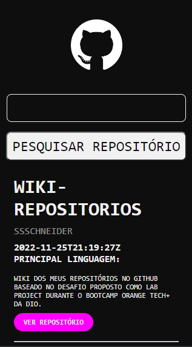

# Wiki de Repositórios

Wiki para busca e navegação entre os meus repositórios do GitHub, conforme proposto como segundo Lab Project do Bootcamp Orange Tech+.

----

## 👩‍💻 O Projeto

Nos foi proposto que criássemos uma wiki com os nossos repositórios, onde o usuário pode buscá-los pelo nome e eles são listados conforme a busca. Resolvi acrescentar informações como data de criação, principal linguagem utilizada, descrição do repositório e link para acessá-lo.

----

## 🔧 Tecnologias Usadas
- HTML
- JSX
- Javascript
- React
- Styled Components
- Axios

----

## 🔗 Acesso 

Para acessar a Wiki, basta <a href="https://wiki-repositorios.vercel.app/">clicar aqui</a>!

----

##  📱 Demo

| Versão Desktop | Versão Mobile |
| ---------------| --------------|
|||